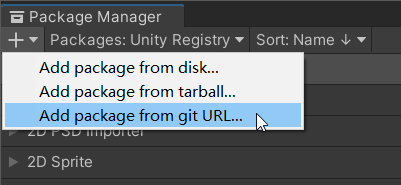

# SerializableDictionary

[](https://github.com/StromKuo/SerializableDictionary/releases) [](https://openupm.com/packages/com.strodio.serializable-dictionary/)

[README](README.md) | [中文文档](README_zh.md)

A package for Unity to serialize Dictionary, HashSet and KeyValuePair.

This project is developed from [azixMcAze's SerializableDictionary](https://github.com/azixMcAze/Unity-SerializableDictionary).


## Installation

### Install via Package Manager

Go to "*MenuBar* > *Window* > *Package Manager* > *Add* > *Add package from git URL*" and enter the URL "https://github.com/StromKuo/SerializableDictionary.git"



### Install via Download

Download and extract this project and put it in the *Packages* folder of your project.

### Install via OpenUPM

Run the following command in your Unity project directory:

```sh
openupm add com.strodio.serializable-dictionary
```

For OpenUPM installation instructions, see the [OpenUPM package page](https://openupm.com/packages/com.strodio.serializable-dictionary/).

## Usage

Before Unity 2020.1, Unity doesn't support serialization of generic class, you need to create a derived class from `SerializableDictionary`, `SerializableHashSet` or `SerializableKeyValuePair`.

```c#
    [SerializeField]
    StringStringDictionary m_StringStringDictionary;

    [SerializeField]
    StringMyClassDictionary m_StringMyClassDictionary;

    [SerializeField]
    ColorHashSet m_ColorHashSet;

    [SerializeField]
    StringIntPair m_StringIntPair;


    [Serializable]
    public class StringStringDictionary : SerializableDictionary<string, string> {}

    [Serializable]
    public class MyClass
    {
        public int i;
        public string str;
    }

    [Serializable]
    public class StringMyClassDictionary : SerializableDictionary<string, MyClass> {}

    [Serializable]
    public class ColorHashSet : SerializableHashSet<Color> {}

    [Serializable]
    public class StringIntPair : SerializableKeyValuePair<string, int> {}
```

After Unity 2020.1:

```c#
    [SerializeField]
    SerializableDictionary<string, string> m_StringStringDictionary;

    [SerializeField]
    SerializableDictionary<string, MyClass> m_StringMyClassDictionary;

    [SerializeField]
    SerializableHashSet<Color> m_ColorHashSet;

    [SerializeField]
    SerializableKeyValuePair<string, int> m_StringIntPair;

    [Serializable]
    public class MyClass
    {
        public int i;
        public string str;
    }
```

## Dictionary of lists or arrays

Unity cannot serialize a array of lists or an array of arrays.

Create a class that inherits from `SerializableDictionaryStorage<List<TValue>`. This storage class will only contain a `List<TValue> data` field.

```c#
[SerializeField]
StringColorListDictionary m_colorStringListDict;


[Serializable]
public class ColorListStorage : SerializableDictionaryStorage<List<Color>> {}

[Serializable]
public class StringColorListDictionary : SerializableDictionary<string, ColorListStorage> {}

// you would have to access the color list through the .data field of ColorListStorage
List<Color> colorList = m_colorStringListDict[key].data;
```
