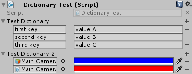
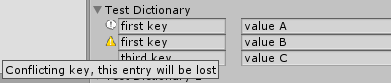
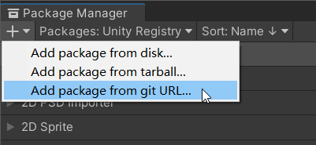

# SerializableDictionary

[README](README.md) | [中文文档](README_zh.md)

一个 Unity package 用来序列化字 Dictionary、 HashSet 和 KeyValuePair 类型.

这个项目是从 [azixMcAze's SerializableDictionary](https://github.com/azixMcAze/Unity-SerializableDictionary) 发展而来.





## 安装

### 通过 Package Manager 安装

找到 "*MenuBar* > *Window* > *Package Manager* > *Add* > *Add package from git URL*" 并输入 URL "https://github.com/StromKuo/SerializableDictionary.git"



### 通过下载安装

下载并解压该项目，然后将其放到你的项目的 *Packages* 目录下.

### 通过 OpenUPM 安装

还不行...

## 使用

在 Unity 2020.1 之前, Unity 不支持序列化泛型类型, 你需要先创建一个继承自 `SerializableDictionary`、 `SerializableHashSet` 或 `SerializableKeyValuePair` 的非泛型类型用于序列化.

```c#
    [SerializeField]
    StringStringDictionary m_StringStringDictionary;

    [SerializeField]
    StringMyClassDictionary m_StringMyClassDictionary;

    [SerializeField]
    ColorHashSet m_ColorHashSet;

    [SerializeField]
    StringIntPair m_StringIntPair;


    [Serializable]
    public class StringStringDictionary : SerializableDictionary<string, string> {}

    [Serializable]
    public class MyClass
    {
        public int i;
        public string str;
    }

    [Serializable]
    public class StringMyClassDictionary : SerializableDictionary<string, MyClass> {}

    [Serializable]
    public class ColorHashSet : SerializableHashSet<Color> {}

    [Serializable]
    public class StringIntPair : SerializableKeyValuePair<string, int> {}
```

从 Unity 2020.1 开始，可以直接序列化泛型类型:

```c#
    [SerializeField]
    SerializableDictionary<string, string> m_StringStringDictionary;

    [SerializeField]
    SerializableDictionary<string, MyClass> m_StringMyClassDictionary;

    [SerializeField]
    SerializableHashSet<Color> m_ColorHashSet;

    [SerializeField]
    SerializableKeyValuePair<string, int> m_StringIntPair;

    [Serializable]
    public class MyClass
    {
        public int i;
        public string str;
    }
```

## 嵌套 list 或 array 类型的 Dictionary

Unity 无法序列化这种类型.

需要先创建一个继承自 `SerializableDictionaryStorage<List<TValue>` 的类型. 该类型只包含 `List<TValue> data` 一个字段.

```c#
[SerializeField]
StringColorListDictionary m_colorStringListDict;


[Serializable]
public class ColorListStorage : SerializableDictionaryStorage<List<Color>> {}

[Serializable]
public class StringColorListDictionary : SerializableDictionary<string, ColorListStorage> {}

// 你需要通过 ColorListStorage 的 .data 字段来访问你的 List<Color>
 colorList = m_colorStringListDict[key].data;
```
