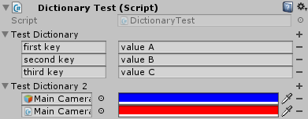
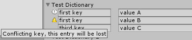

# SerializableDictionary

[](https://github.com/StromKuo/SerializableDictionary/actions/workflows/ci.yml) [](https://github.com/StromKuo/SerializableDictionary/releases) [](https://openupm.com/packages/com.strodio.serializable-dictionary/)

[README](README.md) | [中文文档](README_zh.md)

可序列化的 `Dictionary`、`HashSet` 和类 `KeyValuePair` 类型，并提供可重排的 Unity Inspector 控件。

本项目基于 [azixMcAze 的 Unity-SerializableDictionary](https://github.com/azixMcAze/Unity-SerializableDictionary) 开发，详情参阅[第三方声明](THIRD%20PARTY%20NOTICES.md)。





## 环境要求

- Unity 2022.3 或更高版本。
- 键和值类型必须符合 Unity 的序列化规则。

该包使用 Unity 2022.3 LTS 和 Unity 6 进行测试。

## 安装

### OpenUPM

在 Unity 项目目录中执行：

```sh
openupm add com.strodio.serializable-dictionary
```

通过 scoped registry 安装时请参阅 [OpenUPM 包页面](https://openupm.com/packages/com.strodio.serializable-dictionary/)。

### Git URL

在 Package Manager 中选择 **Add package from git URL**，然后输入：

```text
https://github.com/StromKuo/SerializableDictionary.git
```

如需可复现构建，请附加发布标签，例如 `#v0.2.0`。

## 使用方法

```csharp
using System;
using SKUnityToolkit.SerializableDictionary;
using UnityEngine;

public class Inventory : MonoBehaviour
{
    [SerializeField]
    SerializableDictionary<string, int> itemCounts = new SerializableDictionary<string, int>();

    [SerializeField]
    SerializableHashSet<string> unlockedItems = new SerializableHashSet<string>();

    [SerializeField]
    SerializableKeyValuePair<string, Color> categoryColor =
        new SerializableKeyValuePair<string, Color>("Default", Color.white);
}
```

这些类型继承自标准集合实现，因此运行时可以使用普通 Dictionary 和 HashSet API。

## 嵌套集合

Unity 不能直接序列化嵌套容器，需要用可序列化类包装内层集合：

```csharp
using System;
using System.Collections.Generic;
using UnityEngine;

[Serializable]
public class ColorList
{
    public List<Color> values = new List<Color>();
}

[SerializeField]
SerializableDictionary<string, ColorList> colorsByCategory =
    new SerializableDictionary<string, ColorList>();
```

## 冲突行为与限制

- 字典键重复时保留第一项，后续重复项会被丢弃。
- 空键和已经销毁的 `UnityEngine.Object` 键会被丢弃。
- `DeserializationConflictCount` 表示最近一次反序列化丢弃的字典或 HashSet 条目数。
- 自定义相等比较器只影响当前内存实例，不会被 Unity 序列化。
- 序列化顺序取决于集合枚举顺序，不应作为业务逻辑依据。

更多内容请参阅[完整文档](Documentation~/index.md)、[更新日志](CHANGELOG.md)，以及 Package Manager 中可导入的 **Basic Usage** 示例。

## 许可证

[MIT](LICENSE)
